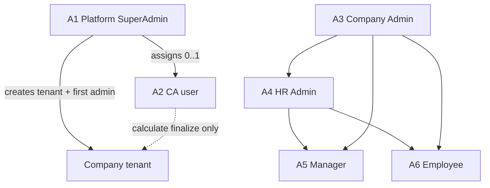
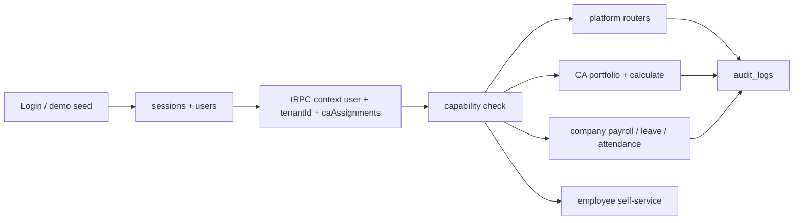

# SaaS RBAC Architecture - Plan

## Goal Capsule

- **Objective:** Ship NusaKerja's three-layer SaaS RBAC so SuperAdmin onboards companies, optional CA operators calculate payroll for assigned clients, and Company Admin / HR / Manager / Employee run isolated company HR + payroll — while preserving the existing customer-liked leave and attendance (punch) product surfaces under role-appropriate views.
- **Product authority:** Product Contract below (from ce-brainstorm + plan-time confirm). Planning Contract and Implementation Units own HOW. Do not redesign statutory rate engines, GPS geofence rules, or TKA permit workflows beyond authorization gates.
- **Execution profile:** Test-first for authorization boundaries (AE scenarios before wiring UI). Prefer extending existing tRPC routers and shared-table `tenantId` isolation over greenfield rewrites.
- **Stop conditions:** Stop if implementing would require destroying existing leave/attendance UX customers already like, or if schema-per-tenant migration is forced mid-slice — escalate rather than silent rewrite.
- **Open blockers:** None.

---

## Product Contract

### Summary

Ship a three-layer Indonesia-only SaaS access model: Platform SuperAdmin creates companies and invites the first Company Admin; each company may have zero or one assigned CA user with calculate-side payroll authority; Company Admin and HR share full company ops with disbursement and filing sign-off; Manager and Employee complete the ladder. Existing leave calculation and attendance punch-out flows stay deployed under RBAC with each role's point of view (CA portfolio vs company HR vs employee self-service). Real control-plane flows ship with login demo-seed accounts.

### Problem Frame

NusaKerja is sold as multi-tenant Indonesian HRMS + payroll for accounting-firm and company operators, but the live product language mixed "CA", "SuperAdmin", and company roles without a settled authority model. Customers already like the existing HR surfaces (leave, punch). Without a clear control plane, CA portfolio boundary, company isolation, and role-appropriate views, planning would invent who can see payroll PII, who creates tenants, and who may finalize filings — or accidentally strip the UDS signature HR flows while adding RBAC.

### Key Decisions

- **Three-layer tenancy** — Platform SuperAdmin above CA firm(s) above company roles; a CA never sees another firm's clients. (session-settled: user-directed — chosen over single CA=platform or firm-only models: preserves platform operator plus portfolio isolation) Governs R1, R2, R6.
- **SuperAdmin-only company create** — Only Platform SuperAdmin creates companies and invites the first Company Admin; CA does not create tenants. (session-settled: user-directed — chosen over CA-create or either-may-create: keeps control plane centralized) Governs R3, R4.
- **CA = calculate operator, not filing signer** — When assigned, CA may prepare and finalize payroll calculation; only Company Admin or HR may approve disbursement and sign off / submit filings. (session-settled: user-directed — chosen over CA-full-operate or CA-prepare-only: split artifact authority) Governs R7, R8, R9.
- **SuperAdmin control plane only** — SuperAdmin manages tenants, first Company Admin, CA assignment, and role-hierarchy visibility; no payroll figures, NIK/NPWP, or payslips. (session-settled: user-directed — chosen over god-mode or break-glass: privacy default) Governs R5.
- **Zero or one CA per company** — Assignment optional; never more than one operating CA. (session-settled: user-directed — chosen over always-one or many CAs) Governs R6.
- **Company Admin + HR full ops** — Both have full company operations including payroll; only Company Admin creates/changes HR seats; HR owns departments, designations, hierarchy, ranking. (session-settled: user-directed — chosen over HR-people-only or separate Payroll Admin at launch) Governs R10, R11, R12.
- **Indonesia only** — Saudi / multi-country tenants are outside product identity for this contract. (session-settled: user-directed — chosen over multi-country shell or Saudi-at-launch) Governs R1.
- **Approach A** — Company-as-tenant with explicit CA assignment grants (not dual-context workspaces or capability matrix). (session-settled: user-directed — chosen over B/C: isolation with least new surface) Governs R2, R6.
- **Demo seed + real flows** — Login demo autofill and seeded actors ship with real SuperAdmin onboarding/invite/assign flows. (session-settled: user-directed — chosen over demo-only or real-only) Governs R16, R17.
- **First SuperAdmin** — `srksourabh@gmail.com` is the initial Platform SuperAdmin identity. (session-settled: user-directed — named operator) Governs R3.
- **Preserve liked HR surfaces** — Leave calculation and attendance punch remain first-class under RBAC; do not remove or replace customer-liked UDS HR behavior while adding authorization. (session-settled: user-directed — plan-time confirm over RBAC-only/payroll-only slice) Governs R20, R21, R22.
- **Role point-of-view UX** — CA sees portfolio/calculate surfaces; company roles see company HR/payroll; employees see self-service. (session-settled: user-directed — plan-time confirm) Governs R23.

### Actors

| ID | Actor | Scope |
|---|---|---|
| A1 | Platform SuperAdmin | Platform control plane; first account `srksourabh@gmail.com` |
| A2 | CA (Chartered Accountant) | Single user per CA firm; assigned companies only; CA point of view |
| A3 | Company Admin | Tenant-scoped; primary + optional deputies; company point of view |
| A4 | HR Admin | Tenant-scoped; full ops except creating HR seats |
| A5 | Manager | Tenant-scoped; attendance and leave approvals |
| A6 | Employee | Tenant-scoped; self-service attendance, leave, payslip |
| A7 | Unassigned company | Valid tenant with no CA; Company Admin/HR hold full payroll path |

### Requirements

**Tenancy and market**

- R1. The product serves Indonesian company tenants only; country packs other than Indonesia are out of identity for this contract.
- R2. Each company is an isolated tenant; no company may read another company's employees, payroll, filings, leave, or attendance data.
- R3. Platform SuperAdmin accounts exist outside any single company tenant and include the seeded identity `srksourabh@gmail.com`.

**Control plane**

- R4. Only Platform SuperAdmin may create a company tenant and send the first Company Admin invite to an email address.
- R5. Platform SuperAdmin may suspend/reactivate tenants, assign or clear a CA, and view the role hierarchy (who holds Company Admin, HR, Manager, Employee seats) without access to payroll amounts, NIK/NPWP, or payslip contents.
- R6. A company may have zero or one assigned CA; SuperAdmin performs assign and clear; a CA never sees companies not assigned to them.

**CA authority**

- R7. An assigned CA may open assigned companies to prepare payroll and finalize payroll calculation for those companies.
- R8. An assigned CA must not approve disbursement or sign off / submit statutory filings.
- R9. A CA firm has exactly one CA user login at launch; that user operates the firm's entire assigned portfolio.

**In-company roles**

- R10. Company Admin and HR Admin both may perform full company operations including payroll calculate, disbursement approval, and filing sign-off.
- R11. Only Company Admin may create, change, or remove HR Admin seats.
- R12. HR Admin may create and maintain departments, designations, hierarchy, and ranking; Company Admin may do the same under R10.
- R13. The first Company Admin is SuperAdmin-invited; that Company Admin may add peer Company Admin deputies with the same powers, including creating HR.
- R14. Manager may approve attendance and leave for their scope and must not run payroll, appoint HR, or access other companies.
- R15. Employee may use self-service attendance, leave requests, and payslip view for self only.

**Demo and proof**

- R16. The login page provides one-click sample credentials that fill username/password for SuperAdmin, CA, Company Admin, HR, Manager, and Employee demo users backed by seeded dummy company data.
- R17. Real control-plane flows (create company, invite first Company Admin, assign/clear CA) work without depending on demo seed credentials in production configuration.

**Audit and legacy**

- R18. Sensitive actions — tenant create/suspend, role changes, CA assign/clear, payroll calculate finalize, disbursement approval, filing sign-off — emit audit events naming actor, tenant, and action.
- R19. Product docs and auth role naming that still use `reseller_admin` / `client_admin` / `payroll_admin` are treated as legacy aliases to migrate toward CA / Company Admin / (folded into Company Admin+HR) under this contract.

**Preserve existing HR + role POV**

- R20. Existing leave request/approval and leave-balance behavior remains available after RBAC ships; authorization gates roles but does not remove the feature.
- R21. Existing attendance punch in/out (including punch-out signature behavior) remains available after RBAC ships; authorization gates roles but does not remove the feature.
- R22. Leave and attendance mutations and reads enforce the same tenant isolation as payroll (R2) and the role rules in R14–R15 for Manager/Employee.
- R23. Post-login default navigation and allowed menus reflect the actor's point of view: SuperAdmin control plane; CA portfolio + assigned-company calculate; Company Admin/HR company HR+payroll; Manager approvals; Employee self-service.

### Key Flows

- F1. SuperAdmin onboards a company
  - **Trigger:** SuperAdmin chooses create company.
  - **Actors:** A1, A3
  - **Steps:** Enter company identity; create isolated tenant; invite first Company Admin email; optional CA assign; Company Admin accepts and enters company.
  - **Outcome:** Tenant exists with exactly one primary Company Admin; CA optional.
  - **Covered by:** R3, R4, R5, R6

- F2. CA works an assigned company payroll calculation
  - **Trigger:** CA opens an assigned company and starts/finalizes calculation for a period.
  - **Actors:** A2, A3, A4
  - **Steps:** CA calculates and may finalize calculation; Company Admin or HR later approves disbursement and signs off filings; CA cannot complete those last two steps.
  - **Outcome:** Calculation complete under CA or company operators; money movement and filing sign-off remain with Company Admin/HR.
  - **Covered by:** R7, R8, R10

- F3. Company Admin appoints HR and org structure
  - **Trigger:** Company Admin creates an HR seat.
  - **Actors:** A3, A4
  - **Steps:** Company Admin invites/assigns HR; HR builds departments, designations, hierarchy, ranking; HR may also run full ops including payroll path per R10.
  - **Outcome:** HR active; org structure editable by HR (and Company Admin).
  - **Covered by:** R11, R12

- F4. Demo seed login
  - **Trigger:** Visitor on login page uses sample-data / autofill control.
  - **Actors:** A1–A6
  - **Steps:** Choose a demo persona; credentials fill; sign-in lands in that persona's permitted surface with dummy data.
  - **Outcome:** Reviewer can exercise the ladder without manual account setup.
  - **Covered by:** R16, R23

- F5. Employee punch and leave under RBAC
  - **Trigger:** Employee punches out or requests leave; Manager approves when required.
  - **Actors:** A5, A6, A4
  - **Steps:** Employee uses existing punch/leave UI; requests are tenant-scoped; Manager/HR approve per role; other tenants unreachable.
  - **Outcome:** UDS leave/punch flows still work; wrong-role and cross-tenant attempts fail.
  - **Covered by:** R20, R21, R22, R14, R15

### Acceptance Examples

- AE1. Cross-company isolation
  - **Covers:** R2, R6
  - **Given:** Company A assigned to CA1; Company B assigned to CA2 or unassigned
  - **When:** CA1 lists companies or opens payroll
  - **Then:** Only Company A appears; Company B data is unreachable

- AE2. SuperAdmin cannot read payroll PII
  - **Covers:** R5
  - **Given:** SuperAdmin views Company A
  - **When:** SuperAdmin opens control-plane company detail
  - **Then:** Hierarchy and tenant metadata are visible; payroll amounts, NIK/NPWP, and payslips are not

- AE3. Filing sign-off blocked for CA
  - **Covers:** R8, R10
  - **Given:** CA finalized calculation for a period
  - **When:** CA attempts disbursement approval or filing sign-off
  - **Then:** Action is denied; Company Admin or HR can complete it

- AE4. Unassigned company still operates
  - **Covers:** R6, R10
  - **Given:** Company with no CA
  - **When:** Company Admin or HR runs calculate, disbursement, and filing sign-off
  - **Then:** All three succeed without a CA

- AE5. Only Company Admin mints HR
  - **Covers:** R11
  - **Given:** HR Admin signed in
  - **When:** HR tries to create another HR Admin
  - **Then:** Denied; Company Admin can create HR

- AE6. Demo personas present
  - **Covers:** R16, R23
  - **Given:** Seeded environment
  - **When:** User uses login sample controls for each persona
  - **Then:** Each of SuperAdmin, CA, Company Admin, HR, Manager, Employee can sign in to an appropriate surface

- AE7. Leave isolation and role gate
  - **Covers:** R20, R22, R14, R15
  - **Given:** Employee in Company A; Manager in Company A; HR in Company B
  - **When:** Employee requests leave; Manager approves; Company B HR lists leave
  - **Then:** Request and approval succeed in A; Company B HR does not see Company A leave

- AE8. Punch isolation and employee self-scope
  - **Covers:** R21, R22, R15
  - **Given:** Two employees in different companies
  - **When:** Each punches out
  - **Then:** Each sees only own attendance history; cross-tenant punch read fails

### Success Criteria

- A reviewer can complete F1–F5 using demo seed without production secrets.
- Authorization tests prove AE1–AE8.
- Existing leave and attendance punch UX remain usable for the correct roles (no feature regression that removes the UDS signature flows).
- `SECURITY.md` / product role language can be updated to match this ladder without inventing new product rules.

### Scope Boundaries

**In scope**

- Platform SuperAdmin control plane, CA assignment, Company Admin/HR/Manager/Employee ladder, payroll authority split, leave/attendance RBAC gates on existing flows, role point-of-view navigation, demo seed login, audit for sensitive actions.

**Deferred for later**

- Multi-user CA firms and limited CA staff roles
- Separate Payroll Admin role
- Break-glass SuperAdmin access into company payroll data
- Custom capability-matrix role builder
- Dual-context workspace product (Approach B)
- Physical schema-per-tenant migration (ADR vs current shared tables)
- Full Auth.js email-provider rewrite beyond password session + invite tokens
- New departments/designations data model beyond minimal stubs if needed for R12 (prefer gate existing UI first)

**Outside this product's identity**

- Saudi Arabia or other-country tenants in the same RBAC product contract
- Building a generic identity platform unrelated to Indonesian HRMS/payroll
- Removing or replacing customer-liked leave/punch product behavior as part of "cleanup"

### Dependencies / Assumptions

- Assumption: CA-reseller demand is the product thesis; no measured Excel/workaround evidence was available during brainstorming.
- Assumption: Existing leave and attendance implementations are the customer-liked baselines to preserve; RBAC wraps them rather than redesigning calculation rules.
- Dependency: Existing multi-tenant direction in docs prefers schema-per-tenant; **this plan continues shared-table `tenantId` isolation** already used in code (see KTD-1).
- Dependency: Auth stack already sketches seven roles in `SECURITY.md` and `@nusakerja/auth`; this contract supersedes naming and authority where they conflict (legacy enum values retained — see KTD-2).
- Assumption: Manager approval scope follows existing product language (attendance and leave) unless planning finds a conflicting implemented behavior that must be called out.

### Outstanding Questions

**Resolve Before Planning**

- None.

**Deferred to Planning / Implementation**

- Q1. Exact invite delivery (email provider, token expiry, resend) for first Company Admin and HR/deputy invites — implement token table + accept URL; email send may be stubbed with logged link in non-prod.
- Q2. Migration mapping display labels from `reseller_admin` / `client_admin` / `payroll_admin` while keeping DB enum values stable this slice.
- Q3. Whether filing sign-off is a new status or a permissioned transition from `APPROVED` — prefer extending existing `payroll_status` with explicit `filingSignedOffBy` fields rather than inventing a parallel engine.
- Q4. Demo-seed credential gating via `NODE_ENV` / explicit `ENABLE_DEMO_LOGIN` so production builds can disable autofill.

### Sources / Research

- `SECURITY.md` — legacy seven-role ladder
- `PRODUCT.md` — accounting-firm buyer and Indonesian statutory positioning
- `ARCHITECTURE.md`, `DECISIONS.md` — schema-per-tenant ADR (conflict with code — KTD-1)
- `packages/auth/src/index.ts` — rank `hasPermission` (insufficient for CA/SuperAdmin splits)
- `packages/db/src/schema/users.ts`, `tenants.ts`, `payroll_runs.ts`, `leave_requests.ts`, `attendance_punches.ts`
- `apps/web/trpc/trpc.ts` — `adminProcedure` lumps SuperAdmin with company admins
- `apps/web/app/api/trpc/[trpc]/route.ts` — context currently `{ user: null, tenantId: null }`
- `apps/web/src/context/auth-context.tsx`, `apps/web/app/login/page.tsx` — client mock auth; partial autofill
- `apps/web/trpc/routers/{payroll,leave,attendance}.ts` — existing feature routers to gate
- Session research notes: `/tmp/compound-engineering-1000/ce-plan-rbac-research.md`

---

## Planning Contract

### Key Technical Decisions

1. **KTD-1 — Shared-table tenant isolation for this slice** — Continue `tenant_id` row filters on company data; do not implement physical schema-per-tenant provisioning now. (session-settled: user-approved — chosen over ADR schema-per-tenant now: matches working code; ADR migration deferred) Governs R2, R22. Conflict call-out: `ARCHITECTURE.md` / ADR-001 still say schema-per-tenant; update docs in U9 to record deferred status.

2. **KTD-2 — Keep legacy `user_role` enum values** — Map CA ↔ `reseller_admin`, Company Admin ↔ `client_admin`; fold `payroll_admin` out of new grants (retain enum member for compatibility). Display names use Product Contract vocabulary. (session-settled: user-approved — chosen over enum rename this PR: honors no-breaking-schema rule) Governs R19.

3. **KTD-3 — Capability checks replace rank-only authorization** — Extend `@nusakerja/auth` with explicit capabilities (e.g. `tenant.create`, `payroll.calculate_finalize`, `payroll.disburse`, `filing.signoff`, `hr.appoint`, `leave.approve`, `attendance.punch_self`) evaluated from role + CA assignment + tenant context. Keep `hasPermission` only if still useful for coarse UI, not for security boundaries. Governs R5, R7, R8, R10, R14, R15, R22.

4. **KTD-4 — Password + DB session for this slice** — Wire tRPC context from `users` + `sessions` (hashed password login). Defer full Auth.js provider rewrite; next-auth dependency may remain unused. Governs R16, R17.

5. **KTD-5 — CA assignment tables** — Add `ca_firms` (or firm on user metadata) and `company_ca_assignments` (tenant_id unique when assigned, user_id of CA). Enforce 0..1 CA in DB unique constraint. Governs R6, R9.

6. **KTD-6 — Payroll authority on existing statuses** — Map calculate finalize → transition to/confirm `CALCULATED` (record `calculatedBy`); disbursement approval → `APPROVED`/`DISBURSED` path for Company Admin/HR only; filing sign-off → dedicated fields/`REVIEWED` gate per Q3. CA denied on disburse/filing. Governs R7, R8, R10.

7. **KTD-7 — Preserve leave/attendance UX; gate routers** — Do not rewrite leave calculation or punch UI; add authz + tenant checks on `leave` and `attendance` routers and role-based nav. (session-settled: user-directed — preserve liked UDS HR) Governs R20–R23.

8. **KTD-8 — Split procedures by plane** — Replace lumping SuperAdmin into company `adminProcedure` for payroll/HR data: `platformProcedure` (SuperAdmin), `caProcedure` (assigned tenants), `companyProcedure` (tenant members). Governs R5, R2.

### High-Level Technical Design

### Assumptions

- Invite email may log magic links in non-production until a provider is configured (Q1).
- `payroll_admin` users in any future data are treated as Company Admin/HR-equivalent for authz mapping or forced remapping in seed only.
- Org hierarchy UI for R12 can remain partially stubbed if no schema exists; do not block RBAC slice on a full org redesign.

### Implementation Constraints

- No breaking changes to existing tRPC procedure input/output shapes where avoidable; add procedures rather than renames when possible (`AGENTS.md`).
- Never hardcode statutory rates (`AGENTS.md`).
- Indonesian error messages on user-facing `TRPCError` where existing routers already do.
- Demo autofill disabled unless `ENABLE_DEMO_LOGIN=true` or non-production (Q4).

### Sequencing

1. U1 schema + capabilities (foundation)
2. U2 session context wiring
3. U3 control plane
4. U4 CA assignment + portfolio
5. U5 payroll authority gates
6. U6 leave + attendance RBAC (preserve UX)
7. U7 role POV nav + login demo seed
8. U8 authorization tests
9. U9 docs alignment

U8 may start characterization tests as soon as U1–U2 land (test-first for AE cores).

---

## Implementation Units

### U1. Schema and capability foundation

- **Goal:** Persist CA firms/assignments and invite tokens; publish capability helpers without yet wiring all UI.
- **Requirements:** R6, R9, R19
- **Files:** `packages/db/src/schema/*`, `packages/db/src/schema/index.ts`, `packages/auth/src/index.ts`, `packages/db/src/seed.ts` (stub hooks only)
- **Approach:** Add assignment + invite tables; unique (tenant_id) on active CA assignment; export capability map keyed by legacy role + context flags (`isAssignedCa`, `isPlatform`).
- **Dependencies:** None
- **Test scenarios:**
  - Capability matrix returns calculate for CA+assignment, denies filing.signoff for CA
  - Unique constraint rejects second CA on same tenant
- **Verification:** `pnpm typecheck` for db/auth packages; unit tests for capability helper

### U2. Authenticated tRPC context

- **Goal:** Replace null context with real session user and tenant binding.
- **Requirements:** R2, R3, R17
- **Files:** `apps/web/app/api/trpc/[trpc]/route.ts`, `apps/web/trpc/trpc.ts`, login API route or action under `apps/web/app/`, `packages/db/src/schema/sessions.ts`
- **Approach:** Login verifies password hash; creates session row; context loads user; platform users have `tenantId=null`; company users bind tenant; CA context carries assignment list.
- **Dependencies:** U1
- **Test scenarios:**
  - Unauthenticated protectedProcedure rejects
  - Company user context includes tenantId
  - SuperAdmin context has no tenant payroll access helpers
- **Verification:** Typecheck + auth context unit/integration tests

### U3. SuperAdmin control plane

- **Goal:** Real create-tenant, invite first Company Admin, suspend, assign/clear CA, hierarchy view without PII.
- **Requirements:** R3, R4, R5, R6, R18
- **Files:** `apps/web/trpc/routers/` (new `platform.ts` or `tenants.ts`), `apps/web/app/(dashboard)/super-admin/page.tsx`, audit writer helper
- **Approach:** Wire stub page to tRPC; hierarchy endpoint returns roles/emails only; never return salary/NIK fields.
- **Dependencies:** U2
- **Test scenarios:**
  - AE2 SuperAdmin hierarchy without PII
  - Non-SuperAdmin cannot create tenant
  - Assign/clear CA audited
- **Verification:** Router tests + manual SuperAdmin seed login

### U4. CA portfolio and enter-company calculate path

- **Goal:** CA lists only assigned companies and may run calculate finalize there.
- **Requirements:** R6, R7, R8, R9, R23
- **Files:** CA portfolio page under `apps/web/app/(dashboard)/`, `apps/web/trpc/routers/payroll.ts`, nav in `apps/web/app/(dashboard)/layout.tsx`
- **Approach:** Portfolio query filters by assignment; entering company sets active tenant for CA session; calculate allowed; disburse/filing denied.
- **Dependencies:** U1, U2, U5 (payroll gates may land with U5 in same PR if sequenced carefully — prefer U5 before exposing UI)
- **Test scenarios:**
  - AE1 isolation
  - AE3 CA filing deny
- **Verification:** Authz tests + CA demo login

### U5. Payroll authority gates

- **Goal:** Enforce calculate vs disbursement vs filing sign-off on payroll router.
- **Requirements:** R7, R8, R10, R18
- **Files:** `apps/web/trpc/routers/payroll.ts`, `packages/db/src/schema/payroll_runs.ts` (optional calculatedBy / filing fields)
- **Approach:** Split mutations; map statuses per KTD-6; Company Admin/HR full path; CA calculate only; SuperAdmin denied company payroll mutations.
- **Dependencies:** U2, U1
- **Test scenarios:**
  - AE3, AE4
  - SuperAdmin payroll mutation denied
- **Verification:** Payroll router authz tests

### U6. Leave and attendance RBAC (preserve UX)

- **Goal:** Keep existing leave and punch flows; enforce tenant + role gates.
- **Requirements:** R14, R15, R20, R21, R22, R23
- **Files:** `apps/web/trpc/routers/leave.ts`, `apps/web/trpc/routers/attendance.ts`, related dashboard/employee pages (nav visibility only — avoid UI redesign)
- **Approach:** Require auth; tenant filter always; Employee self-scope; Manager approve scope; Company Admin/HR full company leave/attendance admin; CA does not need leave admin (read optional — default deny mutations).
- **Dependencies:** U2
- **Test scenarios:**
  - AE7, AE8
  - Existing punch-out still succeeds for employee seed user
- **Verification:** Leave/attendance authz tests + smoke existing pages

### U7. Role point-of-view nav + demo seed login

- **Goal:** Each persona lands on the right home; login autofill covers all roles including CA and Manager; seed creates SuperAdmin `srksourabh@gmail.com` plus demo company users.
- **Requirements:** R3, R16, R17, R23
- **Files:** `apps/web/app/login/page.tsx`, `apps/web/src/context/auth-context.tsx`, `packages/db/src/seed.ts`, dashboard layout nav
- **Approach:** Expand `UserRole` client types; replace localStorage-only mock with session-backed profile when available; demo buttons gated; seed passwords documented in non-prod only.
- **Dependencies:** U2, U3–U6 for destinations
- **Test scenarios:**
  - AE6 all personas
  - Production flag disables demo autofill
- **Verification:** Seed script runs; login smoke for six personas

### U8. Authorization test suite

- **Goal:** Durable AE1–AE8 coverage.
- **Requirements:** Success Criteria authz tests; AE1–AE8
- **Files:** new tests under `packages/auth/` and/or `apps/web/` (introduce Vitest config if missing — currently `pnpm test` is route smoke only)
- **Approach:** Add Vitest for capability + router authz; keep `scripts/verify-app-routes.mjs` as additional smoke. Prefer testing public procedure behavior with forged contexts over UI e2e for this slice.
- **Dependencies:** U1–U6
- **Test scenarios:** Mirror AE1–AE8 as enumerated cases; include negative SuperAdmin PII and CA cross-tenant.
- **Verification:** `pnpm test` (extended) + typecheck + lint on touched packages

### U9. Docs and legacy naming alignment

- **Goal:** Update SECURITY/PRODUCT language; note schema-per-tenant deferred; document role aliases and demo seed.
- **Requirements:** R19; Success Criteria docs
- **Files:** `SECURITY.md`, `PRODUCT.md`, `PROGRESS.md`, `CHANGELOG.md`, optionally `ARCHITECTURE.md` note on deferred physical isolation
- **Approach:** Document three-layer model; alias table; link this plan path.
- **Dependencies:** U1–U8 behavior settled enough to describe accurately
- **Test scenarios:** N/A (doc review)
- **Verification:** Docs mention CA assignment, SuperAdmin PII boundary, leave/punch preservation

---

## Verification Contract

- **Typecheck:** `pnpm typecheck`
- **Lint:** `pnpm lint`
- **Tests:** Extend beyond route smoke — Vitest authz suite for AE1–AE8; retain `pnpm test` / `scripts/verify-app-routes.mjs` for route presence
- **Manual smoke:** Demo login as each of six personas; SuperAdmin create+assign; CA calculate then Company Admin disburse; employee punch-out + leave request
- **Security gates:** Confirm SuperAdmin responses never include salary/NIK/NPWP/payslip payloads; CA cannot hit filing/disburse procedures
- **Regression:** Leave and attendance pages still render and succeed for HR/Employee seeds (UDS signature flows)

## Definition of Done

- All Implementation Units U1–U9 complete or explicitly waived with user approval
- AE1–AE8 automated or, for UI-only residuals, manually evidenced in PR
- Product Contract R1–R23 addressed; no silent drop of R20–R23
- `artifact` docs updated (U9); audit events for R18 actions present
- Abandoned experiment code removed from the diff
- `pnpm typecheck` and `pnpm lint` clean on touched surface; tests green

## System-Wide Impact

- **Auth boundary:** Every company-data router must stop trusting null context
- **Nav/IA:** Role POV changes default homes — risk of breaking bookmarked mock-role workflows
- **Data:** New CA assignment + invite tables; optional payroll actor columns
- **Docs ADR tension:** Shared-table choice must be visible so future schema-per-tenant work is not assumed done
