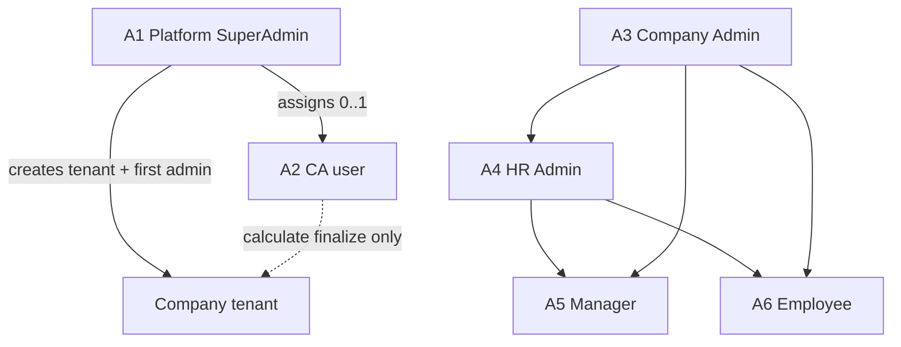

# SaaS RBAC Architecture - Plan

## Goal Capsule

- **Objective:** Define and ship NusaKerja's multi-tenant SaaS RBAC so a Platform SuperAdmin can onboard Indonesian companies, optionally assign a Chartered Accountant (CA) operator, and keep every company's HR/payroll data isolated while Company Admin / HR / Manager / Employee run in-company operations.
- **Product authority:** This plan owns platform tenancy, role ladder, CA assignment, control-plane vs company-plane visibility, payroll finalize split, and demo-seed login. Broader HRMS modules (leave rules, GPS, TKA, statutory rate tables) remain governed by existing product docs and are not redesigned here.
- **Open blockers:** None that block planning. Outstanding items are deferred to planning below.

---

## Product Contract

### Summary

Ship a three-layer Indonesia-only SaaS access model: Platform SuperAdmin creates companies and invites the first Company Admin; each company may have zero or one assigned CA user with calculate-side payroll authority; Company Admin and HR share full company ops with disbursement and filing sign-off; Manager and Employee complete the ladder. Real control-plane flows ship together with login demo-seed accounts.

### Problem Frame

NusaKerja is sold as multi-tenant Indonesian HRMS + payroll for accounting-firm and company operators, but the live product language mixed "CA", "SuperAdmin", and company roles without a settled authority model. Without a clear control plane, CA portfolio boundary, and company isolation rule, planning would invent who can see payroll PII, who creates tenants, and who may finalize filings — the failure modes that break trust for a CA-led Indonesian payroll product.

### Key Decisions

- **Three-layer tenancy** — Platform SuperAdmin above CA firm(s) above company roles; a CA never sees another firm's clients. (session-settled: user-directed — chosen over single CA=platform or firm-only models: preserves platform operator plus portfolio isolation) Governs R1, R2, R6.
- **SuperAdmin-only company create** — Only Platform SuperAdmin creates companies and invites the first Company Admin; CA does not create tenants. (session-settled: user-directed — chosen over CA-create or either-may-create: keeps control plane centralized) Governs R3, R4.
- **CA = calculate operator, not filing signer** — When assigned, CA may prepare and finalize payroll calculation; only Company Admin or HR may approve disbursement and sign off / submit filings. (session-settled: user-directed — chosen over CA-full-operate or CA-prepare-only: split artifact authority) Governs R7, R8, R9.
- **SuperAdmin control plane only** — SuperAdmin manages tenants, first Company Admin, CA assignment, and role-hierarchy visibility; no payroll figures, NIK/NPWP, or payslips. (session-settled: user-directed — chosen over god-mode or break-glass: privacy default) Governs R5.
- **Zero or one CA per company** — Assignment optional; never more than one operating CA. (session-settled: user-directed — chosen over always-one or many CAs) Governs R6.
- **Company Admin + HR full ops** — Both have full company operations including payroll; only Company Admin creates/changes HR seats; HR owns departments, designations, hierarchy, ranking. (session-settled: user-directed — chosen over HR-people-only or separate Payroll Admin at launch) Governs R10, R11, R12.
- **Indonesia only** — Saudi / multi-country tenants are outside product identity for this contract. (session-settled: user-directed — chosen over multi-country shell or Saudi-at-launch) Governs R1.
- **Approach A** — Company-as-tenant with explicit CA assignment grants (not dual-context workspaces or capability matrix). (session-settled: user-directed — chosen over B/C: isolation with least new surface) Governs R2, R6.
- **Demo seed + real flows** — Login demo autofill and seeded actors ship with real SuperAdmin onboarding/invite/assign flows. (session-settled: user-directed — chosen over demo-only or real-only) Governs R16, R17.
- **First SuperAdmin** — `srksourabh@gmail.com` is the initial Platform SuperAdmin identity. (session-settled: user-directed — named operator) Governs R3.

### Actors

| ID | Actor | Scope |
|---|---|---|
| A1 | Platform SuperAdmin | Platform control plane; first account `srksourabh@gmail.com` |
| A2 | CA (Chartered Accountant) | Single user per CA firm; assigned companies only |
| A3 | Company Admin | Tenant-scoped; primary + optional deputies |
| A4 | HR Admin | Tenant-scoped; full ops except creating HR seats |
| A5 | Manager | Tenant-scoped; attendance and leave approvals |
| A6 | Employee | Tenant-scoped; self-service attendance, leave, payslip |
| A7 | Unassigned company | Valid tenant with no CA; Company Admin/HR hold full payroll path |

### Requirements

**Tenancy and market**

- R1. The product serves Indonesian company tenants only; country packs other than Indonesia are out of identity for this contract.
- R2. Each company is an isolated tenant; no company may read another company's employees, payroll, filings, or org data.
- R3. Platform SuperAdmin accounts exist outside any single company tenant and include the seeded identity `srksourabh@gmail.com`.

**Control plane**

- R4. Only Platform SuperAdmin may create a company tenant and send the first Company Admin invite to an email address.
- R5. Platform SuperAdmin may suspend/reactivate tenants, assign or clear a CA, and view the role hierarchy (who holds Company Admin, HR, Manager, Employee seats) without access to payroll amounts, NIK/NPWP, or payslip contents.
- R6. A company may have zero or one assigned CA; SuperAdmin performs assign and clear; a CA never sees companies not assigned to them.

**CA authority**

- R7. An assigned CA may open assigned companies to prepare payroll and finalize payroll calculation for those companies.
- R8. An assigned CA must not approve disbursement or sign off / submit statutory filings.
- R9. A CA firm has exactly one CA user login at launch; that user operates the firm's entire assigned portfolio.

**In-company roles**

- R10. Company Admin and HR Admin both may perform full company operations including payroll calculate, disbursement approval, and filing sign-off.
- R11. Only Company Admin may create, change, or remove HR Admin seats.
- R12. HR Admin may create and maintain departments, designations, hierarchy, and ranking; Company Admin may do the same under R10.
- R13. The first Company Admin is SuperAdmin-invited; that Company Admin may add peer Company Admin deputies with the same powers, including creating HR.
- R14. Manager may approve attendance and leave for their scope and must not run payroll, appoint HR, or access other companies.
- R15. Employee may use self-service attendance, leave requests, and payslip view for self only.

**Demo and proof**

- R16. The login page provides one-click sample credentials that fill username/password for SuperAdmin, CA, Company Admin, HR, Manager, and Employee demo users backed by seeded dummy company data.
- R17. Real control-plane flows (create company, invite first Company Admin, assign/clear CA) work without depending on demo seed credentials in production configuration.

**Audit and legacy**

- R18. Sensitive actions — tenant create/suspend, role changes, CA assign/clear, payroll calculate finalize, disbursement approval, filing sign-off — emit audit events naming actor, tenant, and action.
- R19. Product docs and auth role naming that still use `reseller_admin` / `client_admin` / `payroll_admin` are treated as legacy aliases to migrate toward CA / Company Admin / (folded into Company Admin+HR) under this contract.

### Key Flows

- F1. SuperAdmin onboards a company
  - **Trigger:** SuperAdmin chooses create company.
  - **Actors:** A1, A3
  - **Steps:** Enter company identity; create isolated tenant; invite first Company Admin email; optional CA assign; Company Admin accepts and enters company.
  - **Outcome:** Tenant exists with exactly one primary Company Admin; CA optional.
  - **Covered by:** R3, R4, R5, R6

- F2. CA works an assigned company payroll calculation
  - **Trigger:** CA opens an assigned company and starts/finalizes calculation for a period.
  - **Actors:** A2, A3, A4
  - **Steps:** CA calculates and may finalize calculation; Company Admin or HR later approves disbursement and signs off filings; CA cannot complete those last two steps.
  - **Outcome:** Calculation complete under CA or company operators; money movement and filing sign-off remain with Company Admin/HR.
  - **Covered by:** R7, R8, R10

- F3. Company Admin appoints HR and org structure
  - **Trigger:** Company Admin creates an HR seat.
  - **Actors:** A3, A4
  - **Steps:** Company Admin invites/assigns HR; HR builds departments, designations, hierarchy, ranking; HR may also run full ops including payroll path per R10.
  - **Outcome:** HR active; org structure editable by HR (and Company Admin).
  - **Covered by:** R11, R12

- F4. Demo seed login
  - **Trigger:** Visitor on login page uses sample-data / autofill control.
  - **Actors:** A1–A6
  - **Steps:** Choose a demo persona; credentials fill; sign-in lands in that persona's permitted surface with dummy data.
  - **Outcome:** Reviewer can exercise the ladder without manual account setup.
  - **Covered by:** R16

### Acceptance Examples

- AE1. Cross-company isolation
  - **Covers:** R2, R6
  - **Given:** Company A assigned to CA1; Company B assigned to CA2 or unassigned
  - **When:** CA1 lists companies or opens payroll
  - **Then:** Only Company A appears; Company B data is unreachable

- AE2. SuperAdmin cannot read payroll PII
  - **Covers:** R5
  - **Given:** SuperAdmin views Company A
  - **When:** SuperAdmin opens control-plane company detail
  - **Then:** Hierarchy and tenant metadata are visible; payroll amounts, NIK/NPWP, and payslips are not

- AE3. Filing sign-off blocked for CA
  - **Covers:** R8, R10
  - **Given:** CA finalized calculation for a period
  - **When:** CA attempts disbursement approval or filing sign-off
  - **Then:** Action is denied; Company Admin or HR can complete it

- AE4. Unassigned company still operates
  - **Covers:** R6, R10
  - **Given:** Company with no CA
  - **When:** Company Admin or HR runs calculate, disbursement, and filing sign-off
  - **Then:** All three succeed without a CA

- AE5. Only Company Admin mints HR
  - **Covers:** R11
  - **Given:** HR Admin signed in
  - **When:** HR tries to create another HR Admin
  - **Then:** Denied; Company Admin can create HR

- AE6. Demo personas present
  - **Covers:** R16
  - **Given:** Seeded environment
  - **When:** User uses login sample controls for each persona
  - **Then:** Each of SuperAdmin, CA, Company Admin, HR, Manager, Employee can sign in to an appropriate surface

### Success Criteria

- A reviewer can complete F1–F4 using demo seed without production secrets.
- Authorization tests prove AE1–AE5 (isolation, SuperAdmin PII boundary, CA filing deny, unassigned path, HR mint deny).
- `SECURITY.md` / product role language can be updated to match this ladder without inventing new product rules.

### Scope Boundaries

**In scope**

- Platform SuperAdmin control plane, CA assignment, Company Admin/HR/Manager/Employee ladder, payroll authority split, demo seed login, audit expectations for those actions.

**Deferred for later**

- Multi-user CA firms and limited CA staff roles
- Separate Payroll Admin role
- Break-glass SuperAdmin access into company payroll data
- Custom capability-matrix role builder
- Dual-context workspace product (Approach B)

**Outside this product's identity**

- Saudi Arabia or other-country tenants in the same RBAC product contract
- Building a generic identity platform unrelated to Indonesian HRMS/payroll

### Dependencies / Assumptions

- Assumption: CA-reseller demand is the product thesis; no measured Excel/workaround evidence was available during brainstorming.
- Dependency: Existing multi-tenant direction in `ARCHITECTURE.md` / `DECISIONS.md` (schema-per-tenant) remains the isolation strategy planning should honor unless planning proves it cannot express CA assignments.
- Dependency: Auth stack already sketches seven roles in `SECURITY.md` and `@nusakerja/auth`; this contract supersedes naming and authority where they conflict.
- Assumption: Manager approval scope follows existing product language (attendance and leave) unless planning finds a conflicting implemented behavior that must be called out.

### Outstanding Questions

**Resolve Before Planning**

- None.

**Deferred to Planning**

- Q1. Exact invite delivery (email provider, token expiry, resend) for first Company Admin and HR/deputy invites.
- Q2. Migration mapping and deprecation sequence from `reseller_admin` / `client_admin` / `payroll_admin` enums to the names in this contract.
- Q3. Whether CA "finalize calculation" is a distinct payroll status in the domain model or a permission on an existing status transition.
- Q4. Demo-seed credential storage and how production builds disable or gate sample login controls.

### Sources / Research

- `SECURITY.md` — legacy seven-role ladder including `reseller_admin` and `payroll_admin`
- `PRODUCT.md` — accounting-firm buyer and Indonesian statutory positioning
- `ARCHITECTURE.md`, `DECISIONS.md` — schema-per-tenant isolation decision
- `packages/auth/src/index.ts` — role hierarchy / `hasPermission`
- `packages/db/src/schema/users.ts` — `user_role` enum
- `apps/web/app/(dashboard)/super-admin/page.tsx` — Super Admin tenant onboarding UI stub
- Grounding dossier (session scratch): `/tmp/compound-engineering-1000/ce-brainstorm/rbac-saas-a88a/grounding.md`
